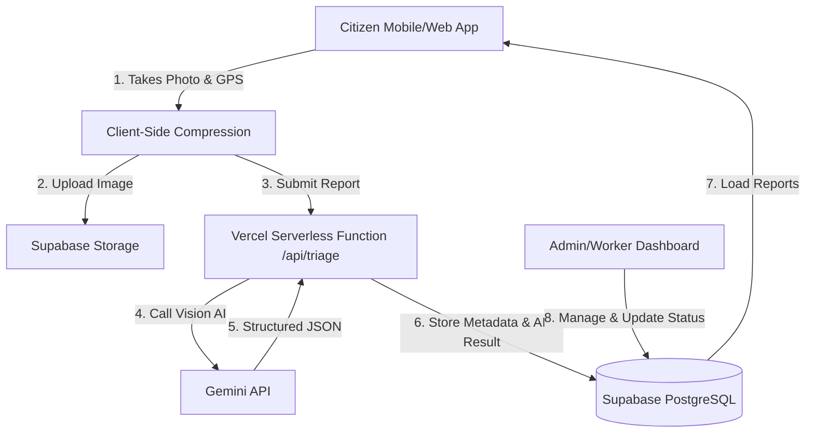

# 🦸‍♂️ Community Hero — A Hyperlocal Civic Issue Reporting Platform

> A modern civic technology platform that empowers residents to report local infrastructure and community problems (potholes, water leaks, broken streetlights, waste accumulation) to improve municipal transparency and accountability. 
>
> Leveraging the **Open311** open standard philosophy, client-side image compression, interactive open-source maps (Leaflet + OpenStreetMap), and server-side **Gemini AI image classification**, Community Hero automatically triages civic complaints to speed up resolution times.

---

## 🏗️ Architecture & System Design



### Key Technical Specs
*   **Frontend**: React (TypeScript) + Vite + Tailwind CSS
*   **Backend**: Supabase (PostgreSQL, Auth, Object Storage)
*   **AI Layer**: Gemini API via `@google/genai` (called via serverless function to prevent API key leaks)
*   **Mapping**: Leaflet + React-Leaflet (zero-cost API key alternative to Google Maps / Mapbox)
*   **Data Visualization**: Recharts (for KPIs and ward performance tracking)
*   **Identity**: Anonymous UUID stored in `localStorage` for citizen reports to reduce signup friction in initial demos.

---

## ✨ Features

### 1. Citizen Reporting Flow
*   **Camera & File Input**: Capture photos or videos of the issue directly.
*   **Precise Geolocation**: Uses the browser's `navigator.geolocation` to automatically pin the issue on a map.
*   **Client-Side Image Compression**: Utilizes `browser-image-compression` to shrink photo sizes before uploading to minimize Supabase Storage usage and reduce Gemini API token latency.

### 2. AI-Powered Triage
*   **Auto-Categorization**: Gemini Vision processes the uploaded image and classifies it into one of 5 key categories:
    1. `Pothole`
    2. `Garbage`
    3. `Streetlight`
    4. `Water Leakage`
    5. `Drainage`
*   **Severity Assessment**: Automatically assigns a severity score (Low, Medium, High).
*   **Structured Output**: Generates raw, typed JSON schemas directly from the AI model (using `thinking_level: minimal` for faster production inference).

### 3. Public Interactive Map & Dashboard
*   **Color-Coded Heatmap/Pins**: Plots reported issues on an OpenStreetMap base map using category-specific pins.
*   **KPI Metrics Dashboard**: Displays real-time counts, average resolution times, and severity breakdowns using Recharts.

### 4. Community Verification (Future Phase)
*   **Peer Validation**: Neighbors can "upvote" or "confirm" reports to filter out duplicates or false alarms.
*   **Gamification**: Users earn badges (e.g., "First Reporter") and trust-scores to increase report credibility.

---

## 🗄️ Database Schema

Community Hero uses Supabase PostgreSQL. Below are the core tables utilized during initial setup:

### `reports`
| Column Name | Type | Description |
| :--- | :--- | :--- |
| `id` | `UUID` (Primary Key) | Unique report identifier |
| `created_at` | `TIMESTAMPTZ` | Submission time |
| `reporter_id` | `UUID` | Local-storage anonymous identifier |
| `category` | `VARCHAR` | Auto-assigned by Gemini (or fallback) |
| `severity` | `VARCHAR` | Low, Medium, High (assigned by Gemini) |
| `description`| `TEXT` | User-provided notes |
| `image_url` | `TEXT` | Link to the file stored in Supabase Bucket |
| `latitude` | `DOUBLE PRECISION`| GPS Latitude |
| `longitude` | `DOUBLE PRECISION`| GPS Longitude |
| `status` | `VARCHAR` | `Open` → `In Progress` → `Resolved` |

### `wards`
| Column Name | Type | Description |
| :--- | :--- | :--- |
| `id` | `BIGINT` (Primary Key) | Unique ward identifier |
| `name` | `VARCHAR` | Ward/District Name |
| `boundary` | `JSON` | GeoJSON polygon coordinates |

---

## 🚀 Setup & Installation

### Prerequisites
*   Node.js (v18+)
*   npm or yarn
*   A Supabase Project
*   A Gemini API Key (from Google AI Studio)

### Local Development Setup

1.  **Clone the Repository**
    ```bash
    git clone https://github.com/Saket745/Vibe2Hack.git
    cd Vibe2Hack
    ```

2.  **Install Dependencies**
    ```bash
    npm install
    ```

3.  **Configure Environment Variables**
    Create a `.env` file in the root directory and add the following keys (see `.env.example`):
    ```env
    VITE_SUPABASE_URL=your_supabase_project_url
    VITE_SUPABASE_ANON_KEY=your_supabase_anon_key
    GEMINI_API_KEY=your_gemini_api_key
    ```

4.  **Start the Local Dev Server**
    ```bash
    npm run dev
    ```
    The application will be running at `http://localhost:5173`.

---

## 📈 Roadmap & Execution Plan

### 📅 Day 1: Core Foundation (8 Hours)
*   [x] **Setup**: Scaffold Vite + React + TS app, tailwind, git repository, and connect to Supabase.
*   [ ] **AI Services**: Implement Vercel serverless function `/api/triage.ts` calling the Gemini API for structured JSON triage.
*   [ ] **Citizen Reporting UI**: Build form with GPS lookup, camera capture, client-side compression, and upload.
*   [ ] **Dashboard and Map**: Display active reports on Leaflet map, visualize key metrics via Recharts.
*   [ ] **Deploy**: Launch live site on Vercel with configured environment variables.

### 📅 Day 2: Workers & Actions
*   [ ] **Worker Login**: Add authentication for municipal workers.
*   [ ] **Resolution Flow**: Workers update status from `Open` to `Resolved` and upload confirmation images.
*   [ ] **Satisfaction Surveys**: Send confirmation notifications back to citizens.

### 📅 Day 3: Fraud Prevention & Verification
*   [ ] **Mismatched Image Detection**: Use Gemini to cross-check the resolution image against the initial report image to detect fraud.
*   [ ] **Duplicate Detection**: Prevent reporting of identical issues within a specific time and space boundary.

---

## 📚 Resources & Citations
*   **Open311 Standard**: [Open311 API Guidelines](http://www.open311.org/) for collaborative issue tracking.
*   **FixMyStreet**: Case study on open civic engagement by Nesta/mySociety.
*   **Pothole Detection**: Research confirming Yolov8 and computer vision models as reliable methods for infrastructure mapping.
*   **Memphis City Study**: Utilizing AI classification on cameras mounted on public transit buses to automatically detect 63,000+ street anomalies.
