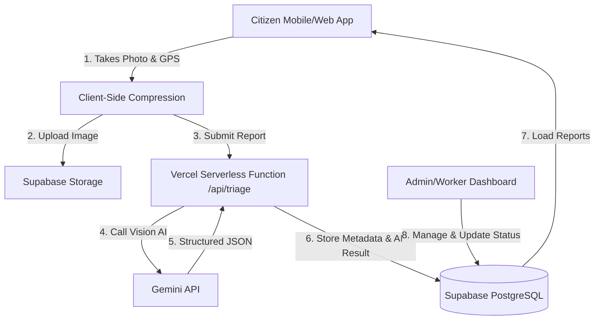

# 🦸‍♂️ Community Hero — A Hyperlocal Civic Issue Reporting Platform

> A modern civic technology platform that empowers residents to report local infrastructure and community problems (potholes, water leaks, broken streetlights, waste accumulation) to improve municipal transparency and accountability. 
>
> Leveraging the **Open311** open standard philosophy, client-side image compression, interactive open-source maps (Leaflet + OpenStreetMap), and server-side **Gemini AI image classification**, Community Hero automatically triages civic complaints to speed up resolution times.

---

## 🏗️ Architecture & System Design



### Key Technical Specs
*   **Frontend**: React (TypeScript) + Vite + Tailwind CSS
*   **Backend**: Supabase (PostgreSQL, Auth, Object Storage)
*   **AI Layer**: Gemini API via `@google/genai` (called via serverless function to prevent API key leaks)
*   **Mapping**: Leaflet + React-Leaflet (zero-cost API key alternative to Google Maps / Mapbox)
*   **Data Visualization**: Recharts (for KPIs and ward performance tracking)
*   **Identity**: Anonymous UUID stored in `localStorage` for citizen reports to reduce signup friction in initial demos.

---

## ✨ Features

### 1. Citizen Reporting Flow
*   **Camera & File Input**: Capture photos or videos of the issue directly.
*   **Precise Geolocation**: Uses the browser's `navigator.geolocation` to automatically pin the issue on a map.
*   **Client-Side Image Compression**: Utilizes `browser-image-compression` to shrink photo sizes before uploading to minimize Supabase Storage usage and reduce Gemini API token latency.

### 2. AI-Powered Triage
*   **Auto-Categorization**: Gemini Vision processes the uploaded image and classifies it into one of 5 key categories:
    1. `Pothole`
    2. `Garbage`
    3. `Streetlight`
    4. `Water Leakage`
    5. `Drainage`
*   **Severity Assessment**: Automatically assigns a severity score (Low, Medium, High).
*   **Structured Output**: Generates raw, typed JSON schemas directly from the AI model (using `thinking_level: minimal` for faster production inference).

### 3. Public Interactive Map & Dashboard
*   **Color-Coded Heatmap/Pins**: Plots reported issues on an OpenStreetMap base map using category-specific pins.
*   **KPI Metrics Dashboard**: Displays real-time counts, average resolution times, and severity breakdowns using Recharts.

### 4. Community Verification (Future Phase)
*   **Peer Validation**: Neighbors can "upvote" or "confirm" reports to filter out duplicates or false alarms.
*   **Gamification**: Users earn badges (e.g., "First Reporter") and trust-scores to increase report credibility.

---

## 🗄️ Database Schema

Community Hero uses Supabase PostgreSQL. Below are the core tables utilized during initial setup:

### `reports`
| Column Name | Type | Description |
| :--- | :--- | :--- |
| `id` | `UUID` (Primary Key) | Unique report identifier |
| `created_at` | `TIMESTAMPTZ` | Submission time |
| `reporter_id` | `UUID` | Local-storage anonymous identifier |
| `category` | `VARCHAR` | Auto-assigned by Gemini (or fallback) |
| `severity` | `VARCHAR` | Low, Medium, High (assigned by Gemini) |
| `description`| `TEXT` | User-provided notes |
| `image_url` | `TEXT` | Link to the file stored in Supabase Bucket |
| `latitude` | `DOUBLE PRECISION`| GPS Latitude |
| `longitude` | `DOUBLE PRECISION`| GPS Longitude |
| `status` | `VARCHAR` | `Open` → `In Progress` → `Resolved` |

### `wards`
| Column Name | Type | Description |
| :--- | :--- | :--- |
| `id` | `BIGINT` (Primary Key) | Unique ward identifier |
| `name` | `VARCHAR` | Ward/District Name |
| `boundary` | `JSON` | GeoJSON polygon coordinates |

---

## 🚀 Setup & Installation

### Prerequisites
*   Node.js (v18+)
*   npm or yarn
*   (Optional) A Supabase Project & Gemini API Key (for Real Mode)

### Mode Options

Community Hero supports two modes of operation:
1.  **Mock Mode (Default Fallback)**: Runs entirely locally without needing Supabase or Gemini credentials. Uses browser `localStorage` as a mock database and pre-seeds it with 30 realistic reports so the dashboard, map, and worker screens are fully populated out-of-the-box!
2.  **Real Mode**: Connects to your live Supabase project and Gemini API for real AI vision triage and storage.

---

### Local Development Setup

1.  **Clone the Repository**
    ```bash
    git clone https://github.com/Saket745/Vibe2Hack.git
    cd Vibe2Hack
    ```

2.  **Install Dependencies**
    ```bash
    npm install
    ```

3.  **Configure Environment Variables**
    Create a `.env` file in the root directory.
    *   **For Mock Mode**: Leave `VITE_SUPABASE_URL` and `VITE_SUPABASE_ANON_KEY` blank. The app will automatically run in local mock database mode.
    *   **For Real Mode**: Fill in the Supabase and Gemini keys:
        ```env
        VITE_SUPABASE_URL=your_supabase_project_url
        VITE_SUPABASE_ANON_KEY=your_supabase_anon_key
        GEMINI_API_KEY=your_gemini_api_key
        ```

4.  **Start the Local Dev Server**
    You can start both the Vite frontend dev server and the mock API server simultaneously using our start script:
    *   **Windows (PowerShell/Command Prompt)**:
        ```bash
        .\start-dev.bat
        ```
    *   **Mac/Linux**:
        Run the frontend and backend in separate terminals:
        ```bash
        # Terminal 1: Start Vite Frontend (port 5173)
        npm run dev

        # Terminal 2: Start API Server (port 3000)
        npx tsx dev-server.ts
        ```
    The application will be running at `http://localhost:5173`.

---

## 🎬 Demo Walkthrough Script

Follow these steps to experience the complete report, triage, resolution, and feedback loop:

### Step 1: Explore Dashboard & Heatmap
1. Open the application at `http://localhost:5173`.
2. Observe the **Explore** and **Stats** tabs.
3. The dashboard is populated with **30 realistic mock reports** spanning all 5 wards and severities.
4. Click on pins on the map to see details, or view the charts showing Category Breakdown and Avg Resolution times.

### Step 2: File a Citizen Report
1. Go to the **Report** tab.
2. Select or capture an issue photo (e.g. click "Take Photo or Upload Image" and select any picture).
3. Enter a description: *"Huge pothole on Commercial Street."*
4. Click **File Civic Report**.
5. Watch the **AI Triage Process** in real-time (loading phases: compressing -> converting -> analyzing -> submitting).
6. On success, see the modal displaying the auto-classified category (`pothole`), severity (`high`), AI explanation, and bounding box overlay.

### Step 3: Manage Queue as a Ward Worker
1. Go to the **Worker** tab.
2. Log in using mock credentials:
   - **Email**: `worker@downtown.com`
   - **Password**: `password`
3. Notice you are logged in as an authorized worker assigned to **Ward 1 - Downtown**.
4. Observe the Action Queue sorted automatically by `needs_manual_review` first, then severity.
5. Click **Manage** on the new report you just filed.
6. Click **Start Investigation** (status changes from Open to In Progress).
7. Click **Resolve Issue**, upload an "after" resolution photo (e.g., any picture), write notes like *"Pothole filled and sealed."*, and click **Confirm Resolution**.

### Step 4: Submit Citizen Feedback
1. Go back to the **Explore** tab.
2. Find your resolved report.
3. Observe the green **Resolved** badge, the resolution notes, and the "After" photo.
4. Rate the resolution 5 stars, write a comment, and click **Submit Feedback**.

---

## 📈 Roadmap & Execution Plan

### 📅 Day 1: Core Foundation (8 Hours)
*   [x] **Setup**: Scaffold Vite + React + TS app, tailwind, git repository, and connect to Supabase.
*   [x] **AI Services**: Implement Vercel serverless function `/api/triage.ts` calling the Gemini API for structured JSON triage.
*   [x] **Citizen Reporting UI**: Build form with GPS lookup, camera capture, client-side compression, and upload.
*   [x] **Dashboard and Map**: Display active reports on Leaflet map, visualize key metrics via Recharts.
*   [x] **Deploy**: Launch live site on Vercel with configured environment variables.

### 📅 Day 2: Workers & Actions
*   [x] **Worker Login**: Add authentication for municipal workers (Supabase Auth).
*   [x] **Resolution Flow**: Workers update status: `Open` -> `In Progress` -> `Resolved`/`Rejected`, upload resolution images and write worker notes.
*   [x] **Audit Log**: Keep track of status history (`report_status_history` table) on status changes.

### 📅 Day 3: Hardening & Validation
*   [x] **Duplicate Detection**: Prevent identical issues within a 5-minute time and 100m spatial boundary.
*   [x] **Abuse Guards**: Add rate limiting per IP and reporter ID, and reject payloads over 1.5MB.
*   [x] **Robust Error Handling**: Handle geolocation denied/unsupported, database query errors with retry, and Gemini API rate-limits.
*   [x] **Demo Seeding**: Seed 30 realistic reports across all 5 wards and severities in mock and production mode.
*   [x] **Advanced Search & Route Engine**: Implemented cross-role search filtering and worker route planning using Haversine nearest-neighbor pathfinding.

---

## 📚 Resources & Citations
*   **Open311 Standard**: [Open311 API Guidelines](http://www.open311.org/) for collaborative issue tracking.
*   **FixMyStreet**: Case study on open civic engagement by Nesta/mySociety.
*   **Pothole Detection**: Research confirming Yolov8 and computer vision models as reliable methods for infrastructure mapping.
*   **Memphis City Study**: Utilizing AI classification on cameras mounted on public transit buses to automatically detect 63,000+ street anomalies.
