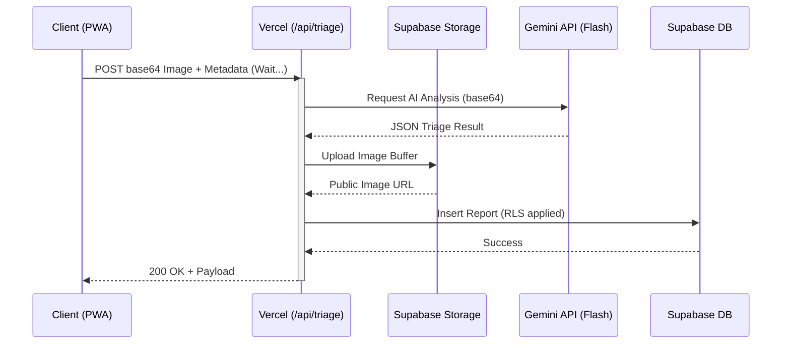
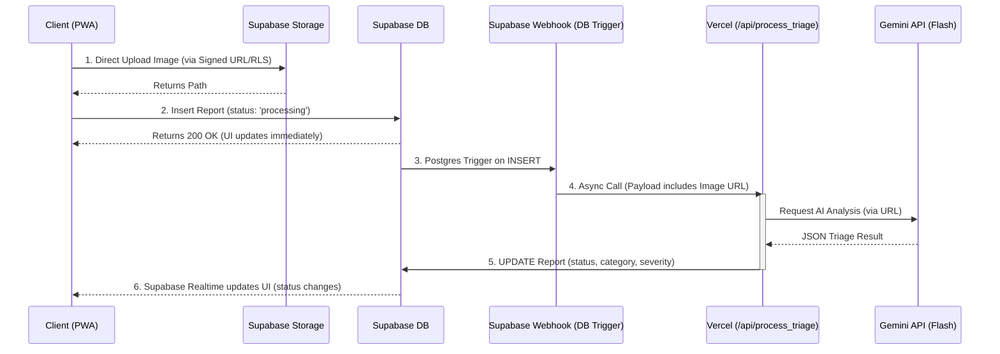

# System Design Review: Community Hero

This document provides a structured software-architecture review of the Community Hero platform, evaluating the services, data flows, API contracts, ML integration, and deployment topology.

## 1. Findings Register

```text
SYSTEM DESIGN REVIEW
=====================
🔴 CRITICAL: F-001 [Synchronous Triage Flow] | Dimension: Data Flow & Consistency | Impact: High risk of Vercel serverless timeouts and dropped reports if the Gemini API experiences latency spikes.
🔴 CRITICAL: F-002 [Base64 Payload Buffering] | Dimension: Scalability & Load | Impact: Pushing raw base64 images directly to the Vercel function consumes excessive serverless memory and bandwidth, risking 413 Payload Too Large errors.
🟡 HIGH:     F-003 [Offline Storage Quota] | Dimension: Reliability & Failure Handling | Impact: `OfflineQueueService` currently uses `localStorage`. Because base64 images are large, users will quickly hit the ~5MB browser quota after queuing just 3-4 reports offline.
🟡 HIGH:     F-004 [Tight Enum Coupling] | Dimension: API & Interface Contracts | Impact: The `category` and `severity` values are strictly hardcoded in the Gemini Prompt, the TS types, and the Postgres `CHECK` constraints. Adding a new category requires simultaneous, perfectly timed updates across all three layers.
🟢 MEDIUM:   F-005 [No ML Failure Fallback] | Dimension: ML Model Serving | Impact: If the Gemini API goes down or returns a 500, the `/api/triage` function throws an unhandled 500 error instead of gracefully falling back to inserting the report with a `needs_manual_review` status.
🟢 MEDIUM:   F-006 [Unstructured Logging] | Dimension: Observability | Impact: The serverless functions rely on standard `console.log`. Tracking a specific `reporter_id` through the logs during a failure will be extremely difficult in Vercel.
```

## 2. Architecture Diagrams

### Current State
Currently, the client acts as a thick orchestrator, pushing heavy payloads through a synchronous serverless function.



### Recommended State (Async Storage & Webhooks)
By decoupling the heavy lifting (image uploads) from the AI processing, we reduce serverless execution time drastically and prevent timeouts.



## 3. Recommendation Roadmap

### Phase 1: Quick Wins (High Impact, Low Effort)
1. **Graceful Degradation for AI Failures (F-005):** Wrap the Gemini API call in a `try/catch`. If the AI request fails or times out, immediately default the report's status to `needs_manual_review` and insert it into the database anyway so the citizen's report is never lost.
2. **IndexedDB Migration (F-003):** Swap out the `localStorage` adapter in `OfflineQueueService` for `localforage` (IndexedDB) to allow offline queuing of dozens of high-resolution images without hitting browser quota limits.

### Phase 2: Foundational Fixes (Medium Effort)
1. **Direct-to-Storage Uploads (F-002):** Refactor the client to upload the image directly to Supabase Storage using RLS policies, bypassing the Vercel function. Send only the public image URL (or path) to `/api/triage`. This eliminates the Base64 memory overhead on the serverless edge.
2. **Structured Logging (F-006):** Introduce a lightweight JSON logger (e.g., `pino`) in the API routes. Ensure every log line injects the `reporterId` and `dedupeHash` for easy trace querying in Vercel Log Drains.

### Phase 3: Structural Changes (High Effort, High Reward)
1. **Asynchronous Triage Architecture (F-001):** As diagrammed above, move `/api/triage` completely out of the critical client path. Let the client insert a raw report into Supabase with status `processing`. Use a Postgres Database Trigger / Webhook to asynchronously call the Vercel function, which updates the row upon completion. The UI already has `useRealtimeNotifications` built-in to handle this seamlessly!
2. **Dynamic Schema Strategy (F-004):** Move the `category` definitions into a dedicated Postgres table (`issue_categories`) and remove the strict `CHECK` constraints on the `reports` table. Fetch valid categories dynamically on app start, inject them into the Gemini prompt dynamically, and validate via foreign key relations rather than hardcoded enums.
